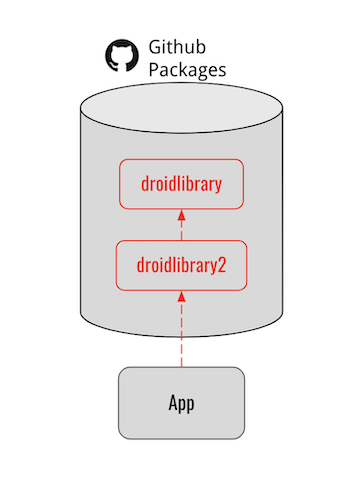
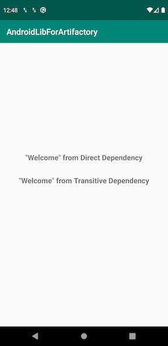

## Demo App to publish Android libraries to Github Packages
Goals To achieve:

- _droidlibrary_ published as an Android library
- _droidlibrary2_ depends on _droidlibrary_, and itself is published as another Android library
- Application declared to depend on _droidlibrary2_ ONLY but **transitively** depends on droidlibrary
- All **source code** of dependency libraries(_droidlibrary & droidlibrary2_) are available for client(app) to navigate into

